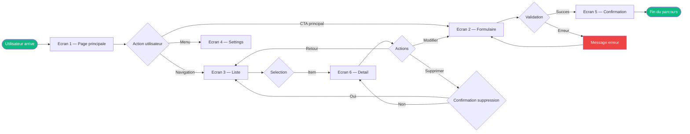

# User Flow — [Nom du parcours]

**Module** : [module]
**Persona** : [persona principal]
**EPIC** : [reference EPIC]
**Date** : [YYYY-MM-DD]
**Genere par** : `/ux` (etape 3.7) ou manuellement

---

## Diagramme

## Etapes du parcours

| # | Ecran | Action | Transition | Etat |
|---|-------|--------|-----------|------|
| 1 | [Ecran 1] | [Action principale] | → [Ecran suivant] | Happy path |
| 2 | [Ecran 2] | [Action] | → Succes / Erreur | Validation |
| 3 | [Ecran 3] | [Action] | → [Detail] | Navigation |

## Edge cases

| # | Cas | Depuis | Comportement | Resolution |
|---|-----|--------|-------------|------------|
| 1 | [Formulaire invalide] | Ecran 2 | Message d'erreur inline | L'utilisateur corrige |
| 2 | [Donnees vides] | Ecran 3 | Etat vide avec CTA de creation | Redirige vers Ecran 2 |
| 3 | [Perte de connexion] | Tout ecran | Toast d'erreur + retry auto | Retry apres 3s |

## Notes

[Decisions de design prises, alternatives explorees, references aux hypotheses]
