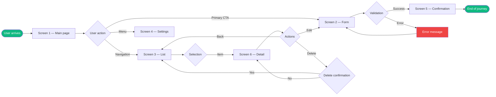

# User Flow — [Journey Name]

**Module**: [module]
**Persona**: [primary persona]
**EPIC**: [EPIC reference]
**Date**: [YYYY-MM-DD]
**Generated by**: `/ux` (step 3.7) or manually

---

## Diagram

## Journey Steps

| # | Screen | Action | Transition | State |
|---|--------|--------|------------|-------|
| 1 | [Screen 1] | [Primary action] | → [Next screen] | Happy path |
| 2 | [Screen 2] | [Action] | → Success / Error | Validation |
| 3 | [Screen 3] | [Action] | → [Detail] | Navigation |

## Edge Cases

| # | Case | From | Behavior | Resolution |
|---|------|------|----------|------------|
| 1 | [Invalid form] | Screen 2 | Inline error message | User corrects |
| 2 | [Empty data] | Screen 3 | Empty state with creation CTA | Redirect to Screen 2 |
| 3 | [Connection lost] | Any screen | Error toast + auto retry | Retry after 3s |

## Notes

[Design decisions made, alternatives explored, hypothesis references]
